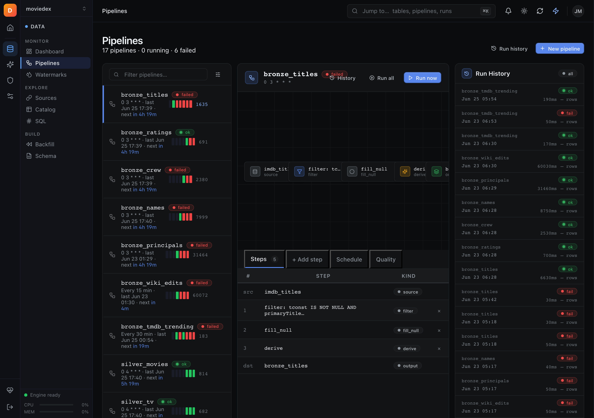
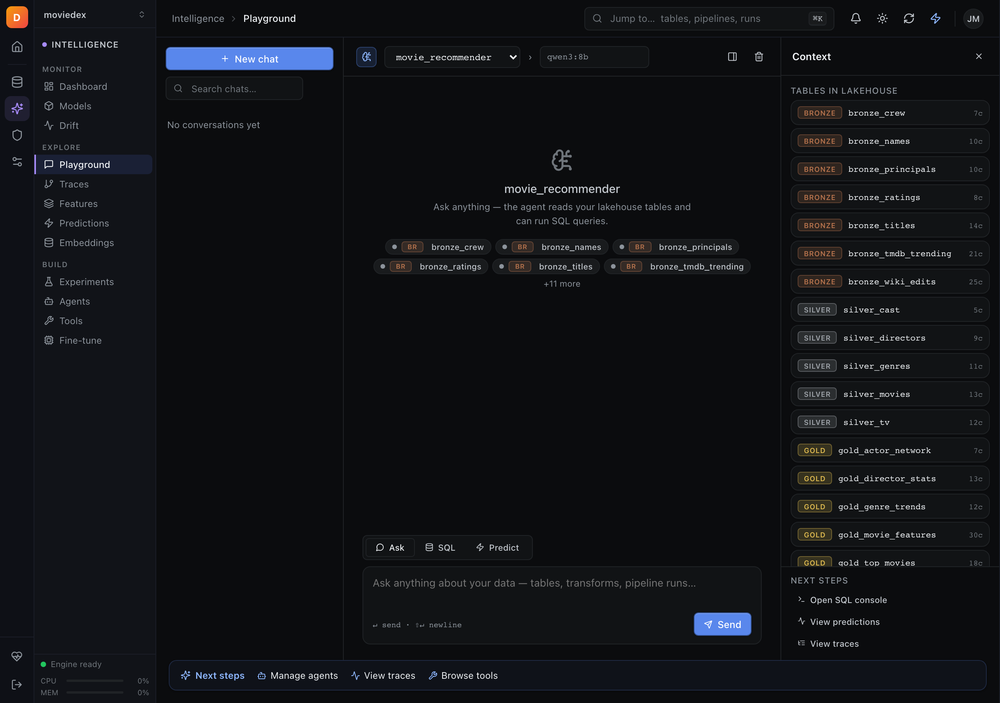
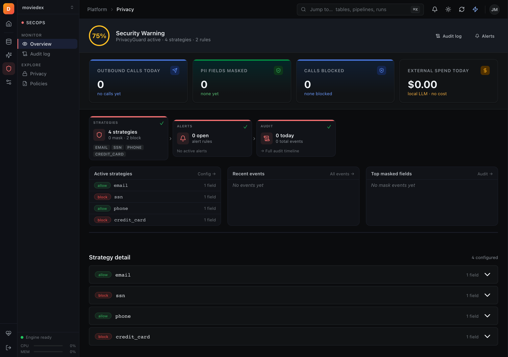
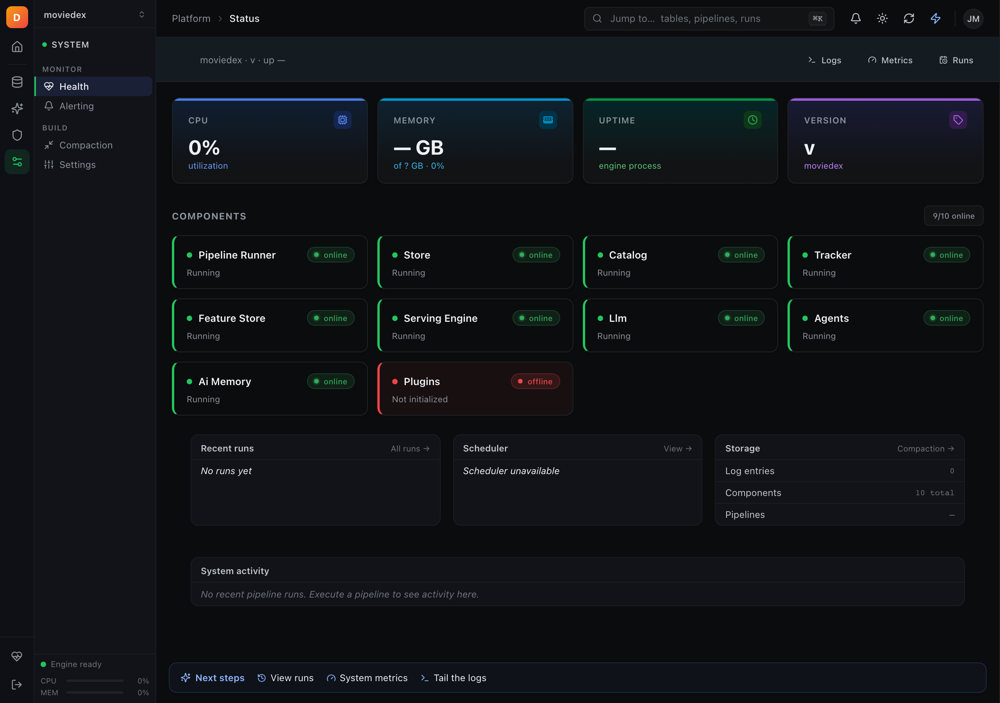

# DEX Studio

[](https://github.com/TheDataEngineX/dex-studio/actions/workflows/ci.yml)
[](https://www.python.org/downloads/)
[](LICENSE)

**Open-source, self-hosted, local-first Data + ML + AI workbench for individuals and small teams. One Docker command. Your data never leaves your laptop.**

[](docs/demo-full.mp4)

> 40-second highlight · [Full walkthrough →](docs/demo-full.mp4)

______________________________________________________________________

## Run it in 60 seconds

```bash
git clone https://github.com/TheDataEngineX/dex-studio && cd dex-studio
docker compose up
# open http://localhost:7860
```

Or run locally without Docker:

```bash
uv sync
uv run poe dev                          # http://localhost:7860 with hot-reload
```

Point it at a specific config via env:

```bash
export DEX_CONFIG_PATH=/path/to/dex.yaml && dex-studio
```

______________________________________________________________________

## What you get

Single page-of-glass UI for everything the [`dataenginex`](https://github.com/TheDataEngineX/dataenginex) library does — no separate API server, no microservices.

| Domain | Screenshots | Features |
| --- | --- | --- |
| **Data** | [](docs/screenshots/data-pipelines.png) | Sources (CSV, Parquet, Postgres, Spark, dbt), Pipelines, SQL console, Warehouse (bronze/silver/gold), Lineage graph, Quality checks, Catalog, Transforms, Streaming, Schema, Backfill |
| **Intelligence** | [](docs/screenshots/intelligence-playground.png) | Playground (SSE streaming chat), Models, Experiments, Dashboard, Agents, Traces, Drift, Embeddings, Features, Predictions, Tools, Finetune |
| **SecOps** | [](docs/screenshots/secops-overview.png) | PrivacyGuard overview, PII strategy config, Audit log, Alert rules, Policies |
| **System** | [](docs/screenshots/system-status.png) | Status, Live log tail (SSE), Metrics, Runs feed, Scheduler, Compaction, Alerting, Costs, Components |

______________________________________________________________________

## Local-first by default

- DuckDB is embedded — no Postgres / Redis required for the base install
- LLM defaults to [Ollama](https://ollama.com) running locally; OpenAI / Anthropic are opt-in
- Optional integrations gated behind `dataenginex` extras (`[postgres]`, `[qdrant]`, `[cloud]`, …)
- Every outbound network call is logged; PII guardrails mask sensitive fields before any external request
- All data lives in `.dex/` next to your project — copy the folder, move machines, you're done

______________________________________________________________________

## Configuration

```bash
# Password set via /setup page on first boot — saved to ~/.dex-studio/auth.hash
export DEX_STUDIO_HOST=0.0.0.0           # default
export DEX_STUDIO_PORT=7860              # default
```

Projects registry: `~/.dex-studio/projects.yaml` — switch between projects via the sidebar dropdown.

______________________________________________________________________

## Tech stack

| Component | Technology |
| --- | --- |
| Server | FastAPI + Uvicorn |
| Templates | Jinja2 (server-rendered HTML) |
| Interactivity | HTMX + Alpine.js |
| Styling | Custom CSS + Radix UI design tokens |
| Engine | [`dataenginex`](https://github.com/TheDataEngineX/dataenginex) — direct import, no HTTP hop |
| Config | PyYAML + Pydantic |
| Build | Hatchling + uv |
| Testing | pytest + httpx TestClient |
| Linting / Types | Ruff + mypy strict |

The frontend stack is frozen for 12 months (no React/Vue/Svelte) — see [ADR-0007](https://github.com/TheDataEngineX/docs/blob/main/adr/0007-local-first-scope-reset.md).

______________________________________________________________________

## Development

```bash
uv run poe lint              # ruff lint
uv run poe lint-fix          # ruff lint + auto-fix
uv run poe typecheck         # mypy strict
uv run poe test              # pytest
uv run poe check-all         # lint + typecheck + test
uv run poe dev               # uvicorn dev server (port 7860, hot-reload)
```

Design tokens: `src/dex_studio/static/studio.css`.

______________________________________________________________________

## Ecosystem

| Repo | Purpose |
| --- | --- |
| [dataenginex](https://github.com/TheDataEngineX/dataenginex) | The Python library (PyPI) — engine, config, all backends |
| [dex-studio](https://github.com/TheDataEngineX/dex-studio) | This repo — web UI |
| [docs](https://github.com/TheDataEngineX/docs) | Documentation site — ADRs + 10-week roadmap |

______________________________________________________________________

## Status

Pre-1.0 · v0.5.0 brings the unified Intelligence domain, two-rail navigation, and expanded Data/System dashboards. See [CHANGELOG](CHANGELOG.md) for the full diff.

______________________________________________________________________

**License:** MIT • **Python:** 3.13+ • **Port:** 7860
