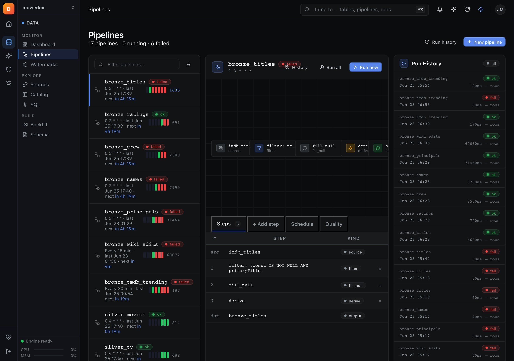
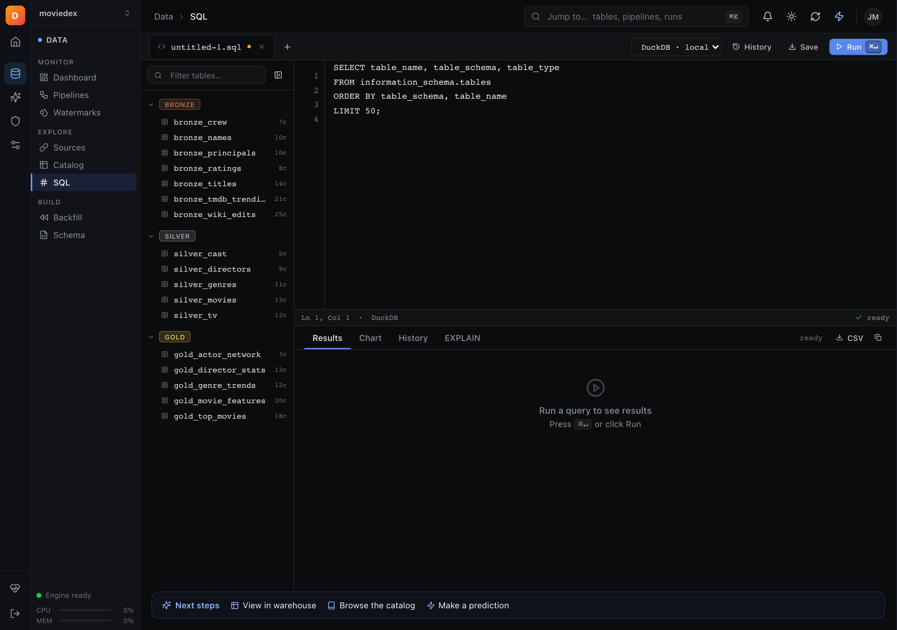
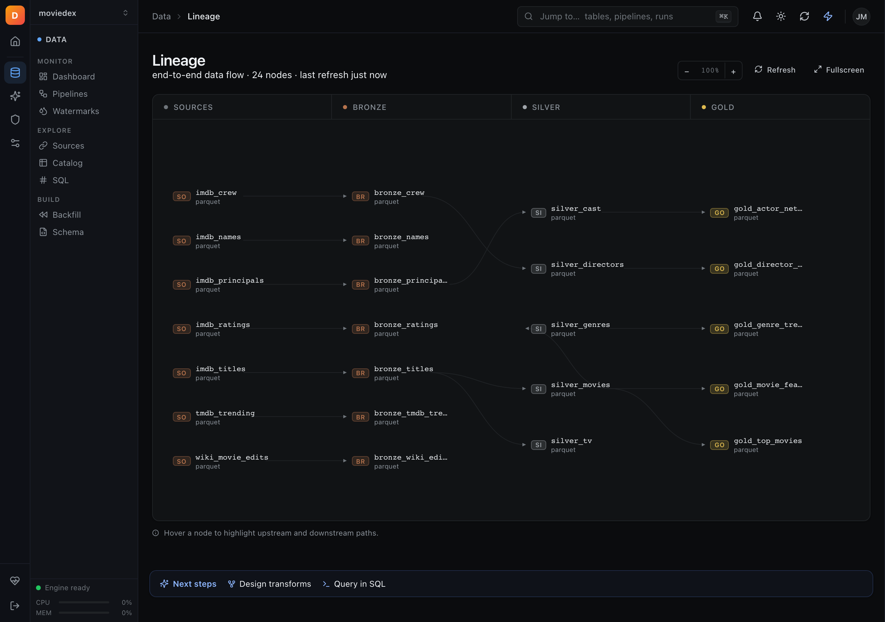
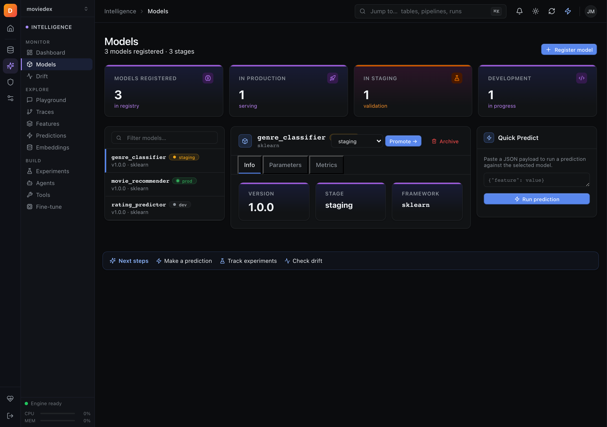
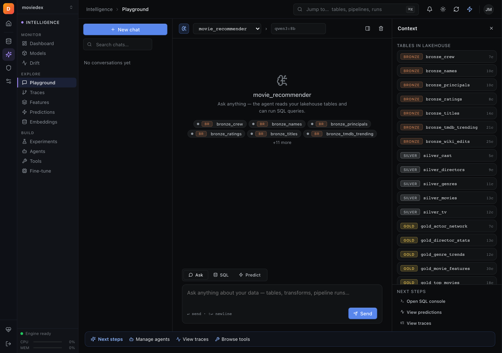
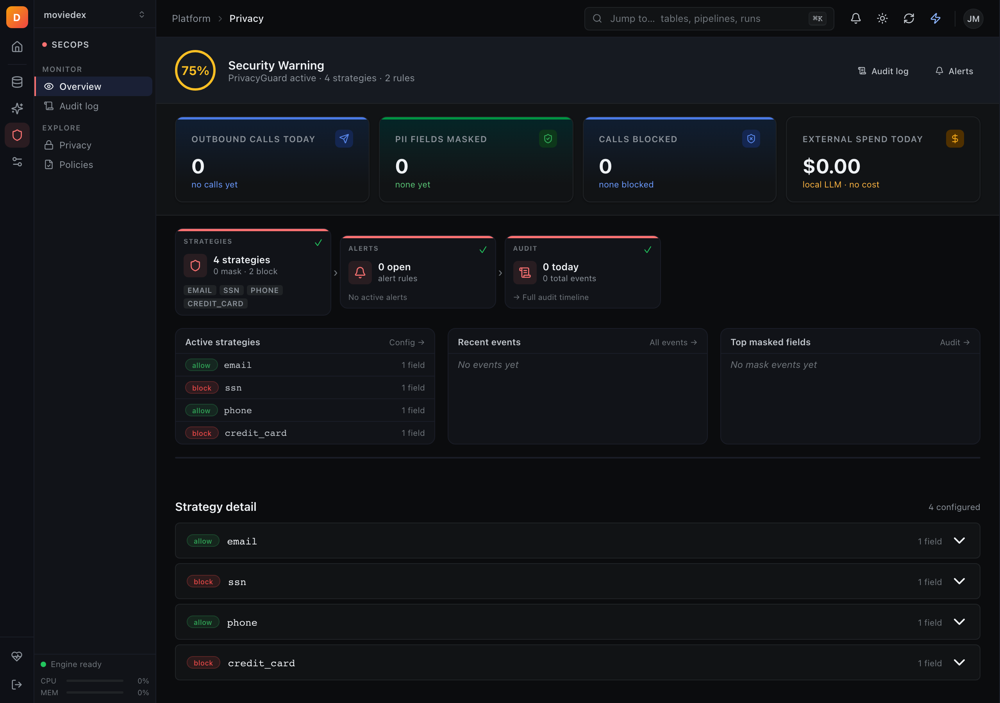
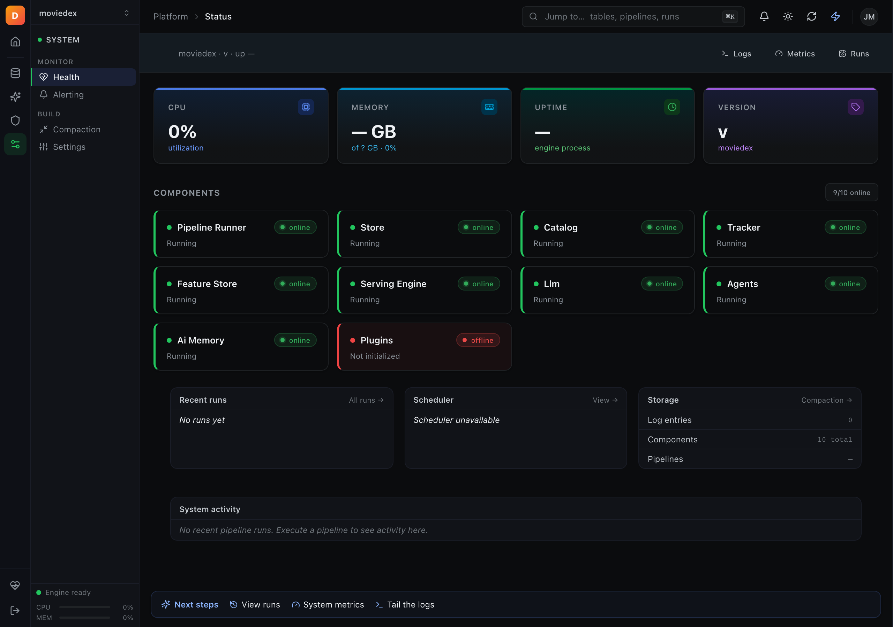
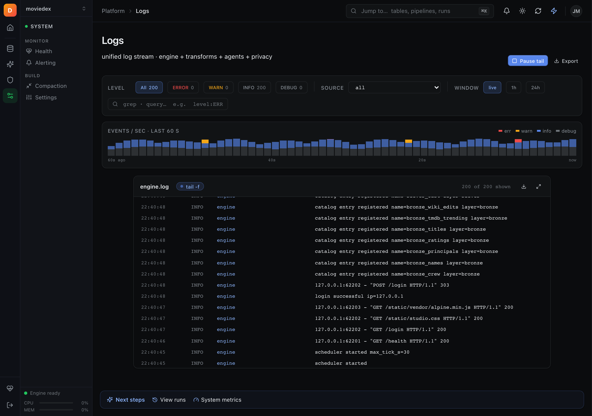
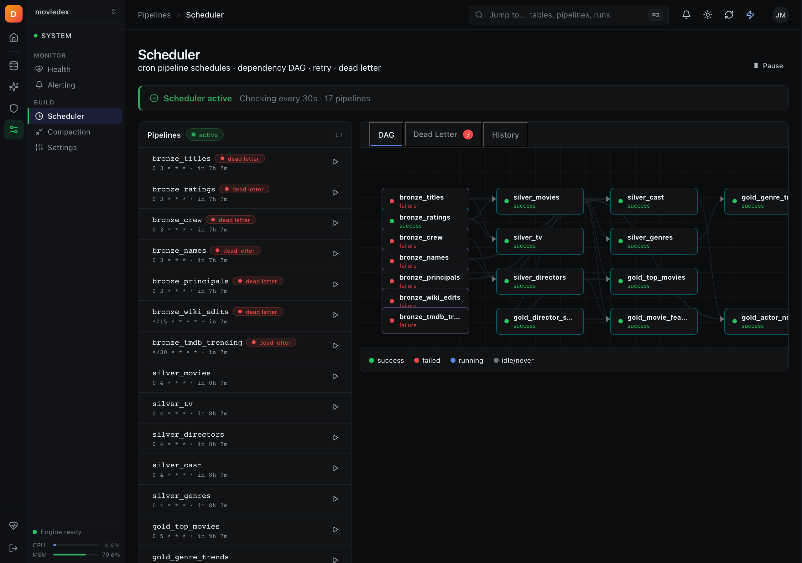

# DataEngineX Studio

[](https://github.com/TheDataEngineX/dex-studio/actions/workflows/ci.yml)
[](https://www.python.org/downloads/)
[](LICENSE)

> **The local-first Data + ML + AI workbench. One command, zero microservices, everything in one process.**

Jupyter is great for notebooks. Airflow is great for orchestration. Streamlit is great for dashboards. This is **all of them in one app** — no stitching together half a dozen tools, no Python ↔ HTTP hops, no data leaving your laptop unless you choose to.

```bash
docker compose up
open http://localhost:7860
```

[](docs/demo-full.mp4)

> **After login →** head to [**Getting Started**](docs/getting-started.md) for your first project, first pipeline, and first AI agent.

> 40-second highlight · [Full walkthrough →](docs/demo-full.mp4)

---

## What is this?

A single-page web UI that gives you **ingestion, pipelines, warehouse, ML, AI agents, RAG, PII guardrails, scheduling, monitoring, and logs** — all backed by one Python library running in the same process.

| Domain | What you can do |
|--------|----------------|
| **Data** | Connect sources (CSV, Postgres, Kafka, Spark, dbt, S3, GCS, …), define DAG pipelines, browse bronz/silver/gold warehouse, run SQL, profile quality, explore lineage |
| **ML / AI** | Train models (sklearn, XGBoost, PyTorch), track experiments in MLflow, serve predictions, detect drift, run RAG pipelines, chat with agents, view traces |
| **SecOps** | Scan for PII, configure masking strategies, review audit logs, set alert rules and policies |
| **System** | View pipeline runs, scheduler status, live log tail (SSE), Prometheus metrics, compaction, components |

Each Studio page maps to a [`dataenginex`](https://github.com/TheDataEngineX/dataenginex) library call — no REST endpoints to version, no separate API to deploy.

---

## Who is this for?

- **Data engineers** who want a local-first workspace for pipeline development before shipping to prod
- **ML engineers** who want to train, track, and serve models without infrastructure overhead
- **Solo devs / small teams** who want one reproducible environment per project, not a platform team
- **Anyone tired of** stitching together Jupyter + Airflow + MLflow + Streamlit + Grafana just to get work done

---

## Why not just use X?

| Tool | DEX Studio does that, plus… |
|------|-----------------------------|
| **Jupyter** | Persistent pipelines, scheduling, warehouse, auth, multi-project — all in one app |
| **Airflow** | Local-first, no DB/redis dependencies, ML/AI, PII guardrails, instant startup |
| **Streamlit** | Multi-page nav, auth, scheduling, persistent state, no `st.*` DSL |
| **Metabase / Grafana** | Read-write pipelines, ML training, agent chat, SQL console, not just dashboards |
| **MLflow UI** | Full data pipeline + warehouse + agent runtime alongside experiment tracking |

---

## Run it

### Docker (recommended)

```bash
git clone https://github.com/TheDataEngineX/dex-studio && cd dex-studio
docker compose up
# open http://localhost:7860
```

### Native

```bash
uv sync
uv run poe dev                          # http://localhost:7860 with hot-reload
```

### Point at a project

```bash
export DEX_CONFIG_PATH=/path/to/dex.yaml && dex-studio
```

---

## Local-first by default

- **DuckDB** embedded — no Postgres / Redis for the base install
- **Ollama** for LLMs — no API keys required; OpenAI / Anthropic are opt-in
- **No microservices** — FastAPI imports `dataenginex` directly; same process, no HTTP hop
- **Portable** — all project data lives in `.dex/` next to your config; copy the folder, move machines
- **Privacy** — every outbound call is logged; PII guardrails mask before any external request
- **Optional scale-out** — swap SQLite → PostgreSQL, add Qdrant, add S3, add Kafka — when you need it

---

## Tech stack

| Component | Technology |
|-----------|-----------|
| Server | FastAPI + Uvicorn |
| Templates | Jinja2 (server-rendered HTML) |
| Interactivity | HTMX + Alpine.js (no JS build step) |
| Styling | Custom CSS + Radix UI design tokens |
| Engine | [`dataenginex`](https://github.com/TheDataEngineX/dataenginex) — direct import, no HTTP |
| Persistence | DuckDB (embedded) + optional PostgreSQL / Qdrant / S3 |
| LLM | Ollama (default) + optional OpenAI / Anthropic / LiteLLM |
| Streaming | Kafka / Redpanda (optional) |
| ML Tracking | MLflow (optional) |
| Build | Hatchling + uv |
| Quality | Ruff + mypy strict + pytest |

---

## Screenshots

| Data pipelines | SQL console | Warehouse lineage |
|---|---|---|
| [](docs/screenshots/data-pipelines.png) | [](docs/screenshots/data-sql.png) | [](docs/screenshots/data-lineage.png) |

| ML models | Agent playground | PII guardrails |
|---|---|---|
| [](docs/screenshots/intelligence-models.png) | [](docs/screenshots/intelligence-playground.png) | [](docs/screenshots/secops-overview.png) |

| System status | Live logs | Scheduler |
|---|---|---|
| [](docs/screenshots/system-status.png) | [](docs/screenshots/system-logs.png) | [](docs/screenshots/system-scheduler.png) |

---

## Development

```bash
uv run poe lint              # ruff lint
uv run poe lint-fix          # ruff lint + auto-fix
uv run poe typecheck         # mypy strict
uv run poe test              # pytest
uv run poe check-all         # lint + typecheck + test
uv run poe dev               # uvicorn dev server (port 7860, hot-reload)
```

Design tokens: `src/dex_studio/static/studio.css`.

---

## Ecosystem

| Repo | Description |
|------|-------------|
| [dataenginex](https://github.com/TheDataEngineX/dataenginex) | The Python library — engine, config, all backends |
| [dex-studio](https://github.com/TheDataEngineX/dex-studio) | This repo — web UI |
| [infradex](https://github.com/TheDataEngineX/infradex) | Kubernetes deployment via ArgoCD |

---

## Status

**Pre-1.0.** Active development. All core phases delivered through 0.5.x. See [CHANGELOG](CHANGELOG.md).

**Contributions welcome** — open an issue or PR. The architecture is small enough to hold in your head (one FastAPI app, ~30 source files).

---

**License:** MIT • **Python:** 3.13+ • **Port:** 7860
