# DEX Studio — Design Document

## 1. Purpose

DEX Studio is a **local, Python-first, open-source web UI** that provides a single
control plane for end-to-end data projects powered by [TheDataEngineX/dataenginex](https://github.com/TheDataEngineX/dataenginex).

It does **not** fork or rebrand upstream DEX. It imports `dataenginex` directly as a library
and unifies all workflows in one place:

```text
Project Setup → Ingestion → Medallion Pipelines → ML/AI → Observability
```

## 2. Architecture

```text
┌──────────────────────────────────────────────────────────────────┐
│                    DEX Studio (FastAPI)                           │
│                                                                   │
│  ┌──────────────────────────────────────────────────────────┐    │
│  │                      Routers                              │    │
│  │  root · data · intelligence · secops · system · api       │    │
│  └────────────────────┬─────────────────────────────────────┘    │
│                        │ Jinja2 templates + HTMX                  │
│  ┌─────────────────────┴───────────────────────────────────┐     │
│  │              Studio Core                                 │     │
│  │  app.py · nav.py · config.py · auth.py · _engine.py     │     │
│  │  studio_db.py · scheduler.py · watermark.py · backfill  │     │
│  │  compaction.py · quality.py · utils · flow · execution  │     │
│  └────────────────────┬────────────────────────────────────┘     │
└───────────────────────┼───────────────────────────────────────────┘
                        │  direct import (same process)
                        ▼
┌──────────────────────────────────────────────────────────────────┐
│                    DexEngine (dataenginex)                         │
│  Config · DexStore · Data (incl. pipeline DAG) · ML · AI          │
└──────────────────────────────────────────────────────────────────┘
```

Studio mounts `dataenginex` via `DexEngine` (see `src/dex_studio/_engine.py`).
No separate DEX server process is required.

> **Note:** Pipeline DAG resolution (`build_dag`, `root_pipelines`, `downstream_of`) lives in
> `dataenginex.data.pipeline.dag` — Studio's scheduler imports from there directly.

### Why FastAPI + Jinja2 + HTMX

| Requirement | Approach |
| --- | --- |
| Server-side rendering (fast initial load) | Jinja2 templates |
| Partial page updates without a JS build step | HTMX attributes |
| Type-safe route handlers | FastAPI + Pydantic |
| Direct library access (no HTTP hop) | `dataenginex` imported in-process |
| Standard Python tooling | pytest TestClient, mypy strict |

## 3. Project Structure

```text
dex-studio/
├── pyproject.toml                  # Hatchling build, deps, poe tasks
├── src/
│   └── dex_studio/
│       ├── __init__.py             # Package + version
│       ├── app.py                  # FastAPI factory — mounts routers, templates, static
│       ├── cli.py                  # CLI entry (dex-studio --host --port --config)
│       ├── config.py               # StudioPrefs + ProjectEntry (projects.yaml, prefs.yaml)
│       ├── auth.py                 # Session-based auth (PBKDF2 password + rate limiter)
│       ├── _engine.py              # DexEngine singleton (get_engine / set_engine)
│       ├── utils.py                # Shared template helpers
│       ├── flow.py                 # Pipeline DAG utilities for the UI
│       ├── routers/
│       │   ├── root.py             # Home, project selector, health
│       │   ├── data.py             # Data domain routes
│       │   ├── intelligence.py     # Intelligence domain routes
│       │   ├── secops.py           # SecOps domain routes
│       │   ├── system.py           # System domain routes
│       │   ├── api.py              # API routes
│       │   └── _deps.py            # Shared FastAPI deps (engine, auth, render)
│       ├── templates/
│       │   ├── base.html           # Layout shell (sidebar, nav)
│       │   ├── components/         # Macros and shared components
│       │   ├── data/               # Data domain templates
│       │   ├── intelligence/       # Intelligence domain templates
│       │   ├── secops/             # SecOps domain templates
│       │   ├── system/             # System domain templates
│       │   └── partials/           # HTMX fragments
│       └── static/
│           └── studio.css          # Styles
├── tests/
│   ├── conftest.py
│   └── unit/
└── docs/
    └── design.md                   # This document
```

## 4. Configuration

```yaml
# ~/.dex-studio/projects.yaml  — registered projects
projects:
  - name: my-project
    path: /home/user/workspace/my-project/dex.yaml
```

```yaml
# ~/.dex-studio/prefs.yaml  — UI preferences
theme: dark
last_project: my-project
```

Key environment variables:

| Variable | Default | Purpose |
| --- | --- | --- |
| `DEX_STUDIO_HOST` | `0.0.0.0` | Bind address |
| `DEX_STUDIO_PORT` | `7860` | Port |
| `DEX_STUDIO_SESSION_SECRET` | auto-generated | Cookie signing key |

## 5. Development Model

Each Studio page calls `DexEngine` methods directly. When Studio needs data that
`dataenginex` doesn't expose yet, the library must be extended first.

| Studio Domain | DexEngine Methods Used |
| --- | --- |
| Data | `run_pipeline`, `source_schema`, `source_sample`, `warehouse_layers`, `warehouse_tables`, `quality_checks` |
| Intelligence | `model_registry.list_models`, `model_registry.predict`, `agents[name].chat`, `drift_detector`, `embedding_search` |
| System | `health`, `config`, `store.list_pipeline_runs` |

### Rule

> **No Studio page without a DexEngine method. No DexEngine method without a Studio page.**

## 6. Technology Choices

| Choice | Rationale |
| --- | --- |
| **FastAPI** | Standard ASGI, type-safe, TestClient for unit tests |
| **Jinja2** | Server-side rendering, no JS build pipeline |
| **HTMX** | Partial updates via HTTP attributes — minimal JS footprint |
| **dataenginex (direct import)** | No HTTP overhead; single process for local use |
| **DuckDB (via DexStore)** | Embedded persistence — zero ops |
| **Separate repo** | Different release cadence, users, and dependency trees |

## 7. Deployment

DEX Studio ships as a Docker image (`ghcr.io/thedataenginex/dex-studio`) deployed via
ArgoCD from [TheDataEngineX/infradex](https://github.com/TheDataEngineX/infradex).

| Environment | Overlay | Triggered by |
| --- | --- | --- |
| Preview | `argocd/previews/dex-studio/<branch>/` | Push to feature branch (auto) |
| Stage | `argocd/overlays/dex-studio-stage/` | Promote workflow (manual) |
| Prod | `argocd/overlays/dex-studio-prod/` | Promote workflow (manual, after stage) |

## 8. Roadmap

### Phase 0 — Foundation ✅

- FastAPI app factory + router scaffold
- DexEngine singleton integration
- Session auth + config system
- CI pipeline

### Phase 1 — Data & ML ← implemented

- Data domain: sources, pipelines, warehouse, quality, lineage
- ML domain: models, experiments, predictions, drift
- AI domain: agents, playground
- System domain: status, logs, metrics, components

### Phase 2 — Interactivity

- HTMX-driven partial updates (live pipeline status, metric charts)
- Pipeline run trigger UI
- Model promotion workflow

### Phase 3 — Multi-Project

- Project switcher
- Config editor
- Multi-instance support

## 9. Screenshots

| Domain | Preview |
| --- | --- |
| Hub | 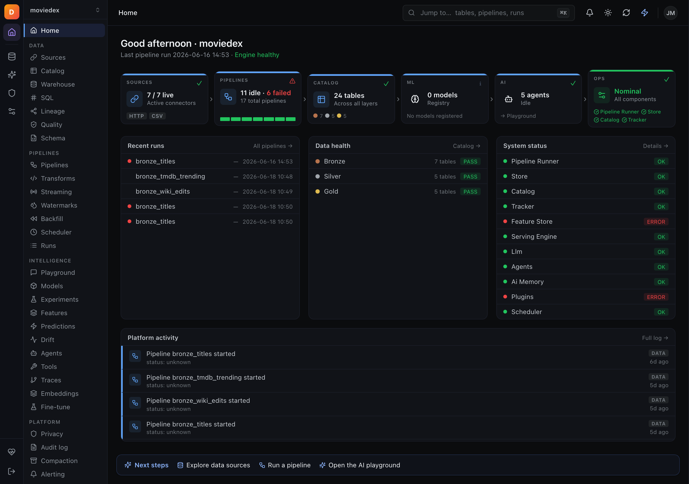 |
| Data — Pipelines |  |
| Data — Sources | 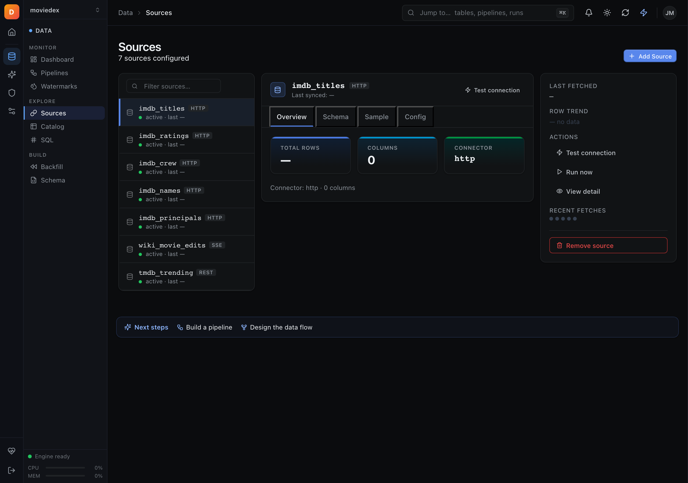 |
| Data — SQL Console | 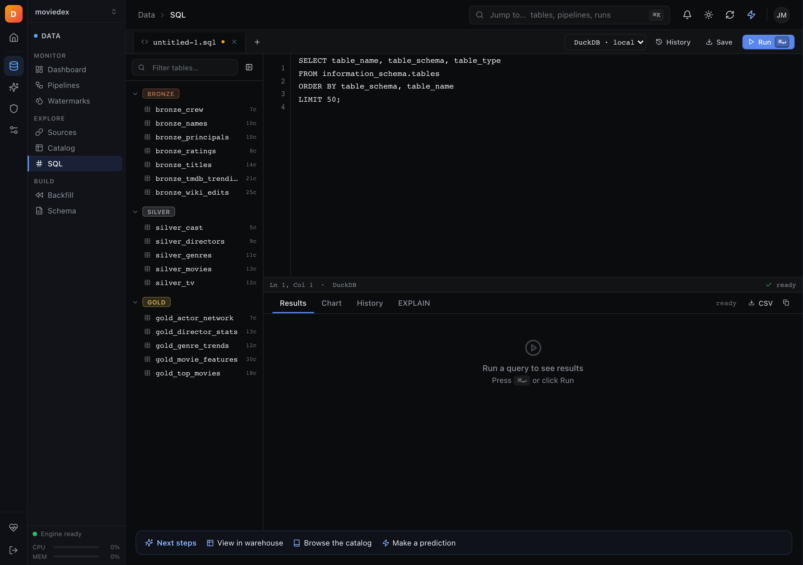 |
| Data — Quality | 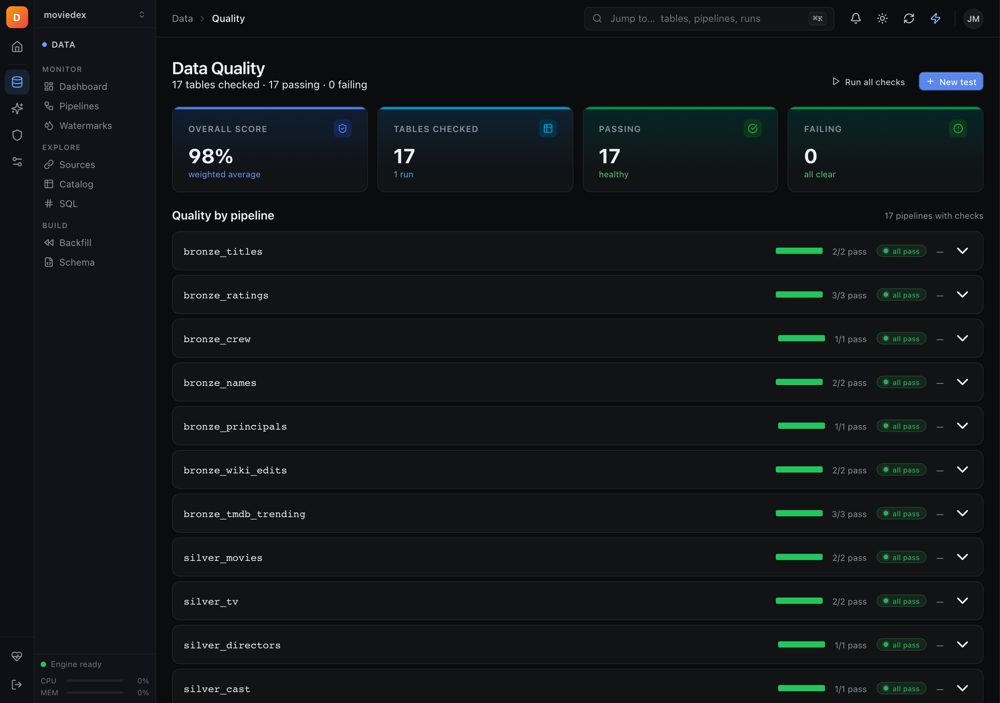 |
| Data — Lineage | 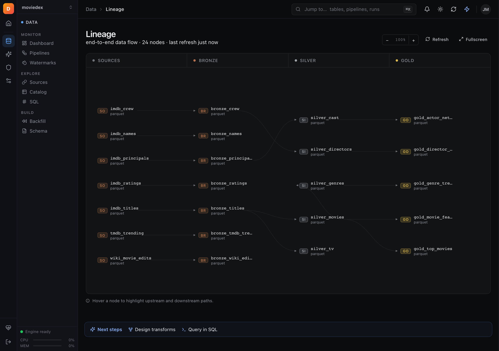 |
| Intelligence — Playground |  |
| Intelligence — Models | 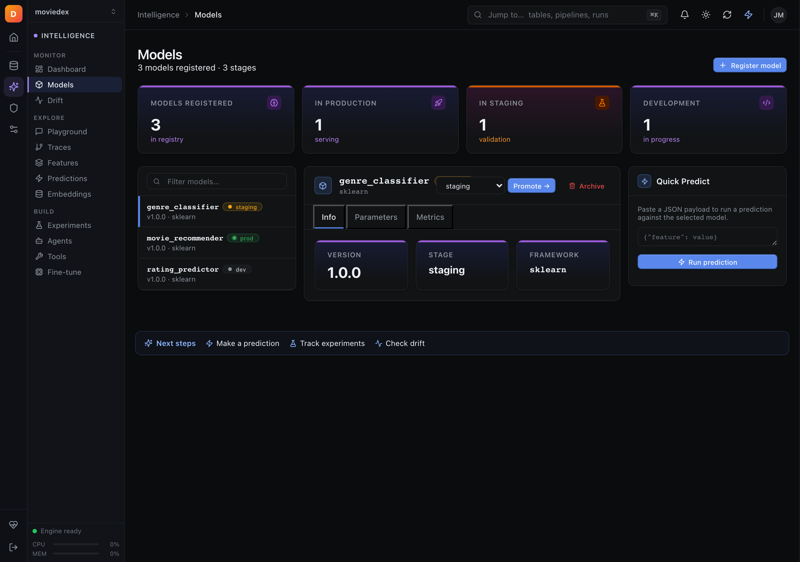 |
| Intelligence — Agents | 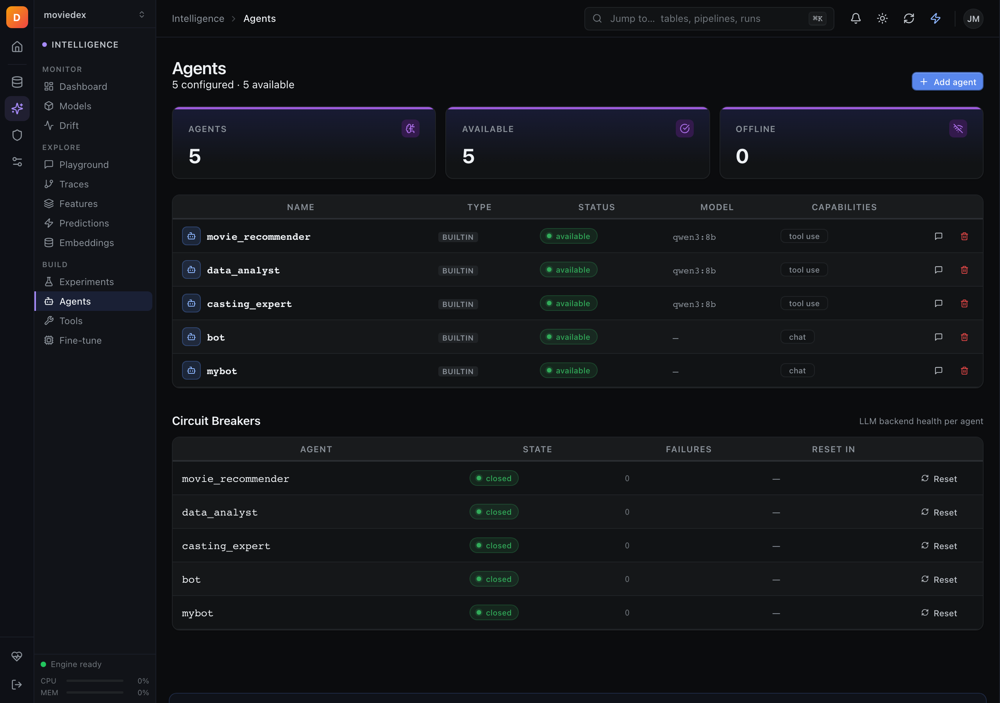 |
| Intelligence — Traces | 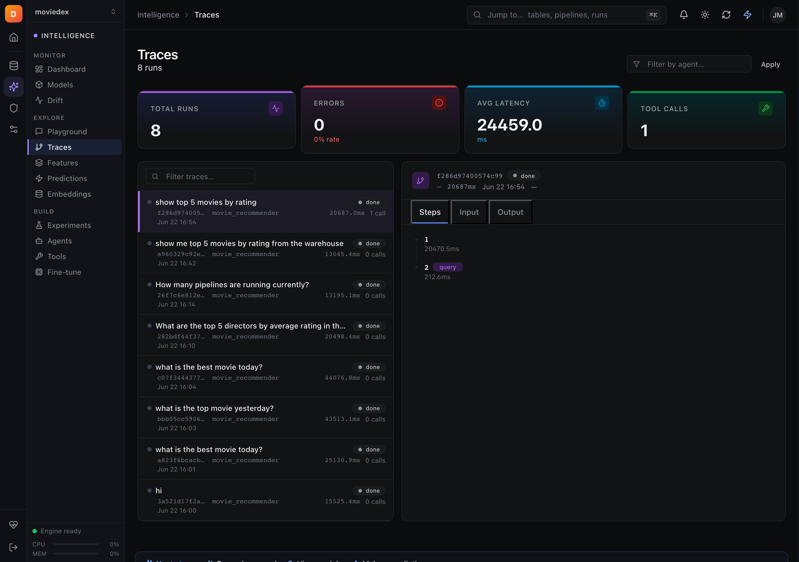 |
| SecOps — Overview |  |
| System — Status |  |
| System — Logs | 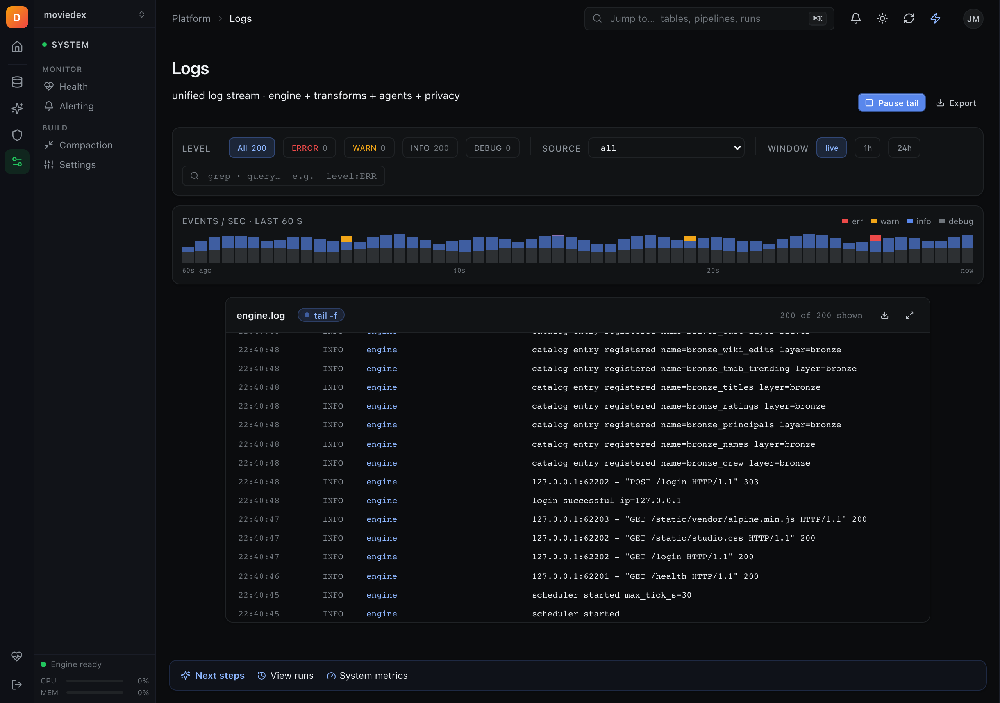 |
| System — Scheduler | 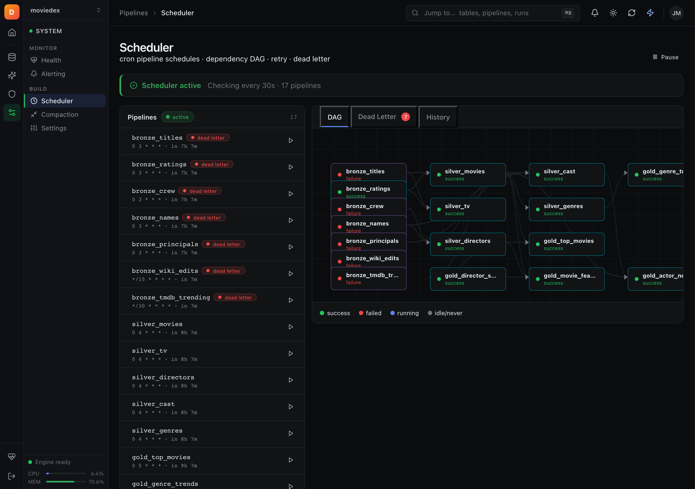 |
| System — Runs | 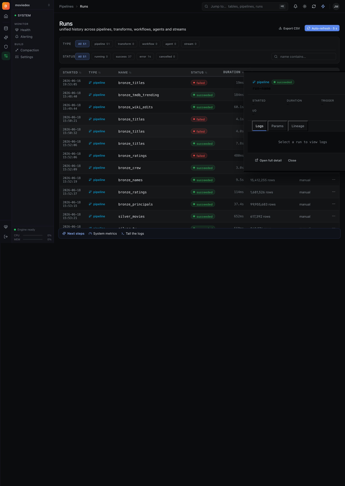 |

## 10. Non-Goals

- **Cloud deployment** — Studio is local-first; no hosted SaaS version
- **Multi-user auth** — single-user or small-team use
- **Data editing** — read-only; mutations are pipeline triggers only
- **Replacing Grafana** — Studio shows DEX-specific views, not generic metric dashboards
